<script type="text/javascript" src="papaya.js"></script>
<script type="text/css" src="papaya.css"></script>


<style type="text/css">
article {
  font-size: 30pt;
}
</style>

```{r knit-setup, include = FALSE}
library(knitr)
opts_chunk$set(cache = TRUE, comment = "", warning = FALSE, echo = FALSE,
               message = FALSE)
library(ggplot2)
library(readr)
library(dplyr)
library(directlabels)

# library(scales)
# library(ANTsR)
# library(extrantsr)
# 
# options(fsl.path = "/usr/local/fsl/")
# options(fsl.outputtype = "NIFTI_GZ")
# library(fslr)
# 
# library(knitcitations)
# library(RefManageR)
# cleanbib()
# options(citation_format = "pandoc")
# bib <- ReadBib("index.bib", check = TRUE)
# 
# hook1 <- function(x){ gsub("```\n*```r*\n*", "", x) }
# hook2 <- function(x){ gsub("```\n+```\n", "", x) }
# knit_hooks$set(document = hook2)
```

## CRAN Packages 5-10 years ago vs. today

- BioC+GitHub `15258` <p style="font-size:12pt">(https://www.rdocumentation.org/)</div>
<div style="font-size:10pt">
Script from [https://gist.github.com/daroczig/3cf06d6db4be2bbe3368](https://gist.github.com/daroczig/3cf06d6db4be2bbe3368)
</div>
```{r}
## plot trend
pkgs = read_csv("results.csv")
ggplot(pkgs, aes(as.Date(first_release), index)) +
    geom_line(size = 2) +
    scale_x_date(date_breaks = '2 year', date_labels = '%Y') +
    scale_y_continuous(breaks = seq(0, 14000, 1000)) +
    xlab('') + ylab("Year") + theme_bw() +
    ggtitle('Number of R packages ever published on CRAN')
```


## Imaging in R: 5 years ago


```{r, out.width = "95%"}
knitr::include_graphics("figure/imaging_task_view.png")
```

----
<div class="container"> 
<div id="left_col2"> 
  <h2>Workflow: 5 years ago</h2>
<div style='font-size: 32pt;'>

- bash  
- FSL  
- ANTs  
- MRIcroGL 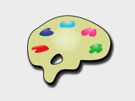 
- OsiriX  
- SPM 12 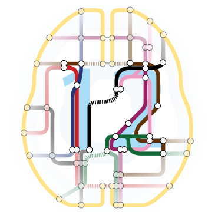 

</div>
  </div>    
  <div id="right_col2">

  </div>
</div>


----
<div class="container"> 
<div id="left_col2"> 
  <h2>Workflow: 5 years ago</h2>
<div style='font-size: 32pt;'>
  
Multiple pieces of software used

  - all different syntax
</div>
  </div>    
  <div id="right_col2">

  </div>
</div>


# R: Programming and Interface Language 


----
<div class="container"> 
<div id="left_col2"> 
  <h2>Workflow: Now</h2>
<div style='font-size: 24pt;'>
  
- all R code
    - interface/pipeline tool
    - "native" R code

Complete pipeline
  
  - preprocessing and analysis
</div>
  </div>    
  <div id="right_col2">

  </div>
</div>

## Imaging in R: Now

```{r, out.width = "95%"}
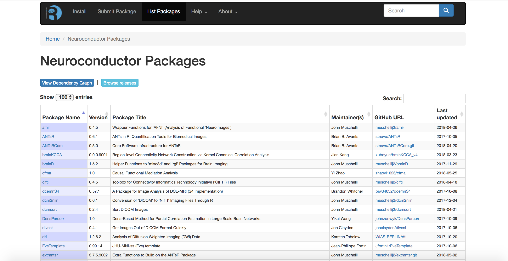
```


## Weaknesses of Imaging in R

<div id = "left_col">
- Speed, but `Rcpp`, not always ported to `Rcpp`
  - A lot of work to inferface with large libraries
- Memory issues 
- MATLAB is more popular and has GUIs
- System Dependencies are not handled well in packages

</div>
<div id = "right_col">
```{r, out.width = "100%"}

```
<div style="font-size:10pt">https://giphy.com/gifs/top-gun-need-for-speed-i-feel-the-26AHLNr8en8J3ovOo</div>

- e.g. (fsl, FSL, install FSL at https://fsl.fmrib.ox.ac.uk/fsl/fslwiki/FslInstallation)

</div>

## Strengths of Imaging in R

<div id = "left_col">

- Free
- Large/strong R community
- RStudio
- Validated statistical models
- Package development system
- Neuroconductor
- Shiny
</div>
<div id = "right_col">
```{r, out.width = "100%"}
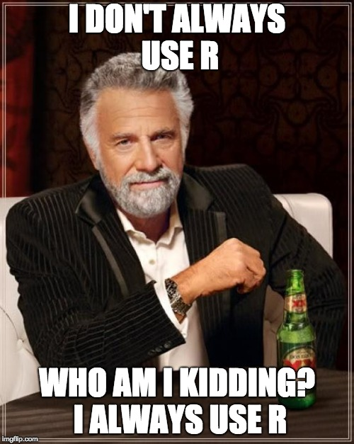
```
<div style="font-size:10pt">https://imgflip.com/i/2blglk</div>

</div>

## Threats of Imaging in R

- Not much different than Python 
    - scikit-learn/ Nipype
- Neural Networks 
- BME have tools for advanced statistical analysis
- **Study design is not as valued in imaging (neuro)**
  - one stronghold of statisticians
- Credit/Incentives for software

## Opportunities of Imaging in R

- Neural Networks: Keras and Tensorflow
- Most analyses still do general linear models
- Genomic analyses are very similar
  - use Bioconductor tools in a new way


## Opportunities of Imaging in R

- Neural Networks: Keras and Tensorflow
- Most analyses still do general linear models
- Genomic analyses are very similar
  - use Bioconductor tools in a new way

  
## Opportunities: CONSORT diagrams

<div style="font-size:10pt">https://imgflip.com/i/2bltgh</div>
```{r, out.width = "90%"}
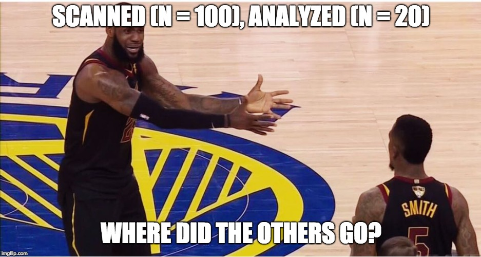
```


  
## Opportunities of Stats in Imaging

<div style="font-size:25pt">

- Task fMRI: compare baseline to 1+ conditions
- Smoothed to account for neighborhood
- Run LM on time-series voxelwise with AR-type correlation with HRF-convolved design matrix ($X$) + motion/other factors ($Z$)

$$
Y_{iv} = X_{i} \beta_{iv} + Z_{i}\theta_{iv} + \varepsilon_{iv} \\
\varepsilon_{iv} \sim N(0, \Sigma_{iv}) \\
\Sigma_{iv} \sim \text{AR}
$$

$Z_{i}$ can be different for each $i$ (scrubbing), but usually isn't.

</div>


## Opportunities of Stats in Imaging

- Get $β_i$ map in MNI space
- Run t-test, random effects analysis (hard to find sometimes), or permutation test
- Perform multiple comparisons correction (maybe with spatial compoent)

</div>

## Opportunities of Stats in Imaging 

<div id = "left_col"  style="font-size:24pt">
- What if the motion had a non-linear effect?
  - currently: use derivatives and squared effects
  - why not GAMs? (speed)`voxel` package 
- fully Bayes (spatial) hard because of data size (maybe empirical)

</div>
<div id="right_col">
```{r, out.width = "120%"}
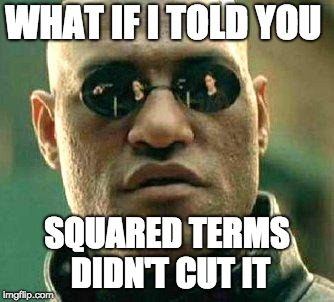
```
<div style="font-size:10pt">https://imgflip.com/i/2bltw2</div>
</div>


----
<div id = "left_col">
```{r, out.width = "70%"}
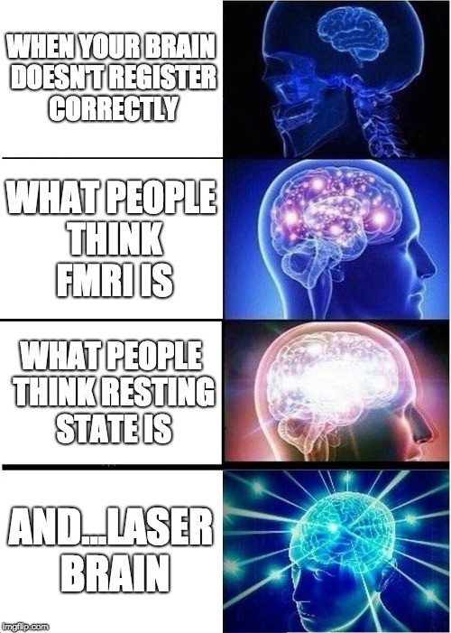
```
</div>
<div id="right_col">
<h2> Opportunities of Stats in Imaging: Laser Brain</h2>
<div style="font-size:10pt">https://imgflip.com/i/2blg14</div>

<div>


## Opportunities of Stats in Imaging 

<div id = "left_col" style="font-size:22pt">
- **Multi-site/multi-scanner data from consortium**
  - batch effects abound  
</div>
<div id="right_col" style="font-size:22pt">


```{r, out.width = "120%"}
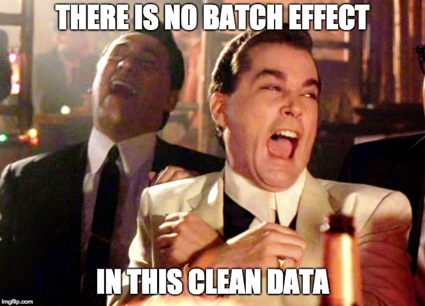
```
<div style="font-size:10pt">https://imgflip.com/i/2blid6</div>
</div>

## Opportunities: Data

<table border="1">
    <tr>
    <td height="250"></td>
    <td height="250"></td>
    <td height="250"></td>
    <td height="250"></td>
    </tr>
    <tr>
    <td height="250"></td>
    <td height="250"></td>
    <td height="250"></td>
    <td height="250"></td>
    </tr>
</table>


<!-- ## What can we do in R? -->

<!-- 1. Read/Write Images -->
<!-- 2. Visualization of Images -->
<!-- 3. Inhomogeneity/Bias Field Correction -->
<!-- 4. Skull Stripping/Brain Extraction -->
<!-- 5. Image Registration -->
<!-- 6. Tissue-Class Segmentation -->
<!-- 7. Image operations -->
<!-- 8. Complex Modeling -->
<!-- 9. Neural Networks  -->

## What we need: tutorials

```{r, out.width = "95%"}

```

## What we really need: tutorials on fMRI

- `preprocessfMRI` from ANTsR
- `spm12r` - https://neuroconductor.org/neuroc-help-fmri-analysis-spm12r
- `fslr` - https://neuroconductor.org/neuroc-help-fmri-analysis-fslr

# What we need: Shiny GUIs

## (Maybe) What we need: challenges

https://grand-challenge.org/all_challenges/

```{r, out.width = "95%"}
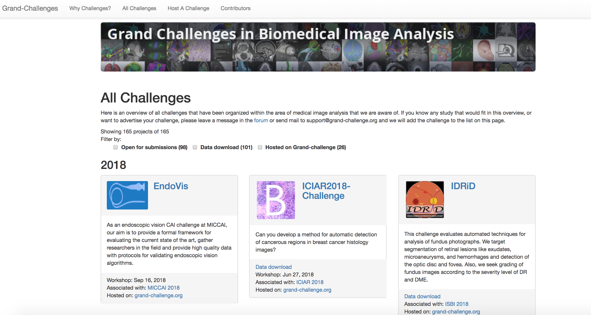
```

## "Pre"-processing is Important

<div class = "left-half">
```{r, out.width = "100%"}
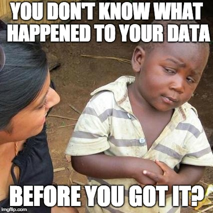
```
<div style="font-size:10pt">https://imgflip.com/i/2blh8f</div>
</div>
<!-- <div class = "right-half"> -->
<!-- ```{r, out.width = "100%"} -->
<!-- 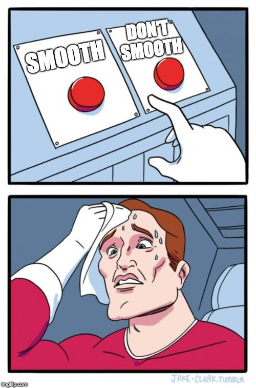 -->
<!-- ``` -->
<!-- <div style="font-size:10pt">https://imgflip.com/i/2blhsc</div> -->

</div>

## "Pre"-processing is Hard

<div class = "left-half">
```{r, out.width = "100%"}

```
<div style="font-size:10pt">https://imgflip.com/i/2blh8f</div>
</div>
<div class = "right-half">
```{r, out.width = "75%"}

```

<div style="font-size:10pt">https://imgflip.com/i/2blhsc</div>

</div>


# Package Showcase

## Data

- `EveTemplate`/`MNITemplate` - templates
- `kirby21` series
- `sri24` - SRI24 MRI Atlas
- `malf.templates` - templates for label fusion
- `neurohcp` - download data from HCP/INDI
- `nitrcbot` - download data from NITRC
- `neurovault` - download data from https://neurovault.org/

  
## General Imaging Tools

- `EBImage` - image processing and analysis
- `magick` - Bindings to ImageMagick
- OpenCV: [`swarm-lab/ROpenCVLite`](https://github.com/swarm-lab/ROpenCVLite) or [`ropenscilabs/opencv`](https://github.com/ropenscilabs/opencv)
- `ANTsR` - a large imaging suite (mainly neuro)


## Starting from Raw Data/DICOM

- `oro.dicom` - read/write DICOM data
- `dcm2niir` - uses `dcm2niix` from Chris Rorden
- `divest` - `Rcpp` wrapped `dcm2niix`
- `dcmtk` - interface package for DCMTK
- `matlabr` - could use `dicomread` MATLAB code and excecute through R


## Interactive Visualization using papayaWidget

```{r, cache=FALSE}
library(papayaWidget)
library(kirby21.t1)
fname = get_t1_filenames()[1]
papayaWidget::papaya(img = fname)
```


## `ggneuro` visualization: `ggplot2` object

```{r}
ggneuro::ggortho(fname)
```


## Intensity Normalization

- `whitestripe` - WhiteStripe [@shinohara_statistical_2014]
- Quantile transform `quantile_img` (in `neurobase`)
- Whole brain z-scoring: `zscore_img` in `neurobase`
- `RAVEL` - @ravel
- Histogram matching (in `RAVEL`)
- General standardization methods 

## MS Lesion Segmentation

- `sublime` - @sublime
- `oasis` - @oasis
- `mimosa` - @mimosa
- `smri.process` - my package on sMRI processing

  
## Step 1: Image Processing: Workflow 
<div class="left-half">
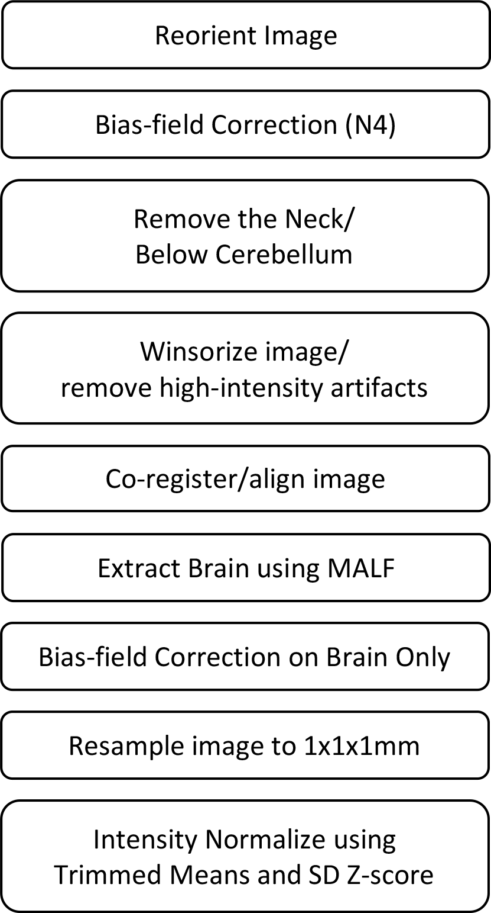 
</div>
<div class="right-half" style="font-size:25pt">
The N4 [@tustison_n4itk_2010] EM-style model assumed is:
$$
\log(x(v)) = \log(u(v)) + \log( f(v) )
$$

- $x$: given image
- $u$: uncorrupted image
- $f$: bias field 
- $v$: location in the image
</div>


## Image Processing: MALF

<div class="container">
<div id="left_col">
Figure from MASS paper [@mass]:


</div>
<div id="right_col" style="font-size:25pt">
- Register templates to an image using the T1 for that subject
- Apply transformation to the label/mask
- Average each voxel over all templates
    - there are "smarter" (e.g. weighted) ways
</div>
</div>

## Step 2: Create Predictors for each Sequence 

<div id="left_col">
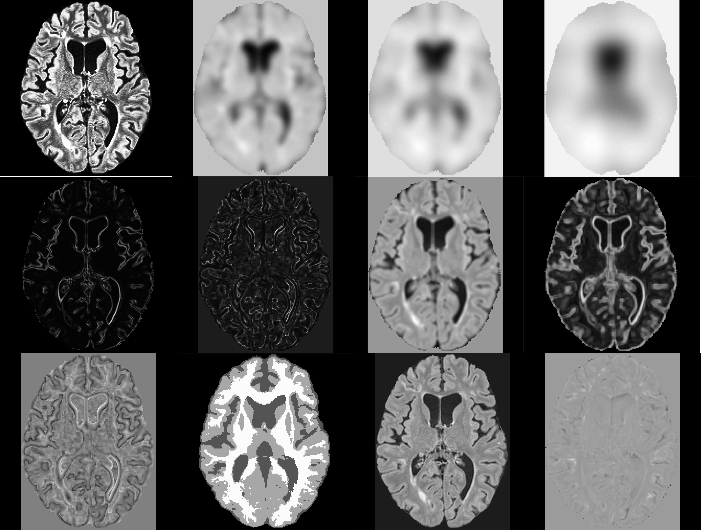  
</div> 
<div id="right_col" style="font-size:22pt"> 
- Predictors created with intensity-normalized data
  - Quantile images, smoothers, local moments
- Tissue class probability with local moments: MALF and FAST [@fast]
- Z-score to a population template 
</div>

## A package to do all this: `smri.process`

- GitHub package (`muschellij2/smri.process`)


## Publishing software

- R Journal - see `rticles::rjournal_article()` (only accept if in CRAN)
- F1000 - https://f1000research.com/collections/Neuroconductor
- JOSS - https://joss.theoj.org/
- JSS - see `rticles::jss_article()`
- `cranlogs` track downloads
- neuroconductor API tracks downloads

## Tracking downloads

```{r}
if (!require(cranlogs)) {
  library(devtools)
  install_github("metacran/cranlogs")
  library(cranlogs)
}
first_date = "2014-01-10"
today = Sys.Date()
long_today = format(Sys.time(), "%B %d, %Y")
packs = c("brainR", "cifti", "diffr", "fedreporter", "freesurfer", "fslr", 
"gcite", "gifti", "glassdoor", "kirby21.base", "kirby21.fmri", 
"kirby21.t1", "matlabr", "neurobase", "neurohcp", "neurovault", 
"papayar", "rscopus", "spm12r", "stapler", "WhiteStripe")
# from muschpack
gh = c("alvin", "biobankr", 
       "dcm2niir", "dcmtk", "dhs", "drammsr", 
       "extrantsr", "ggneuro", "ghtravis", 
       "gluc", "greedyreg", "ichseg", "itksnapr", 
       "jhudsl", "kirby21.asl", "kirby21.det2", "kirby21.dti", 
       "kirby21.flair", "kirby21.mt", "kirby21.smri", "kirby21.survey", 
       "kirby21.t2", "kirby21.vaso", "leanpubr", "lungct", "malf.templates", "msmri",
       "neuroc.deps", "neurocInstall", "papayaWidget",  "rcamino", 
       "robex", "smri.process")
# packs = c(packs, gh)
packs = sort(unique(packs))

packs = unique(packs)
dl = cran_downloads( from = first_date, to = today,
	packages = packs)
cum_dl = dl %>% 
  arrange(date) %>% 
  group_by(package, date) %>% 
  summarise(count = sum(count)) 
cum_dl = cum_dl %>% 
  arrange(date) %>% 
  group_by(package) %>% 
  mutate(count = cumsum(count))
cum_dl = cum_dl %>% 
  filter(count > 0)

cum_dl = cum_dl %>% 
  group_by(package) %>% 
  mutate(label = if_else(
    date == max(date), 
    as.character(package), NA_character_)) 

max_date = max(cum_dl$date)
min_date = min(cum_dl$date)

ggplot(cum_dl, aes(x = date, y = count, colour = package)) + 
  geom_line() +
  guides(colour = FALSE) +
  scale_x_date(date_breaks = '6 months', date_labels = '%Y') +
  xlab('') + ylab("Year") + theme_bw() +
  geom_dl(aes(label = package), 
          method = list(dl.trans(x = x + 0.2), 
                        "last.points", cex = 0.8)) + 
  xlim(c(min_date, max_date + 6*35))
```

## Conclusions

- Many methods are being developed for processing neuroimaging in R
- Analysis tools exist but need adaptation 
- Develop more standardization like BioConductor
    - standard data structures
- GitHub and Neuroconductor


# Where else can statisicians lead?


<!-- ## Visualization: 3-dimensions -->


<!-- ```{r spinning_brain, message=FALSE, results='hide', eval = FALSE} -->
<!-- devtools::source_gist("bd40d10afabc503d71e8") -->
<!-- ``` -->

<!-- 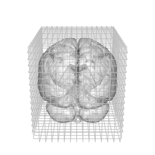 -->

# Do we need spatial results?  If not, why register to the template?

## Registration

<div class = "left-half">
ANTsR/extrantsr

- `antsRegistration` - rigid/affine/non-linear diffeomorphic
- `extrantsr::registration` - wraps antsRegistration to use `nifti` objects
</div>
<div class = "right-half">
fslr

- `flirt` - linear/affine registration
- `fnirt` - non-linear registration (need affine first)
- `fnirt_with_affine` - wraps above 2
<div>


## Bibliography

<div style = "font-size: 12pt">
